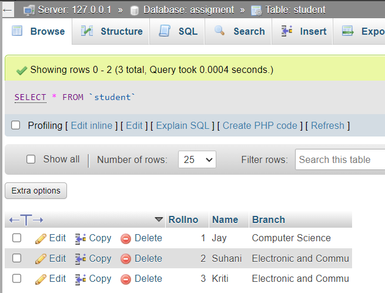

## Create Table Name : Student and Exam

<hr>

## Exam Table

```
CREATE TABLE Exam (
    Rollno INT,
    S_code VARCHAR(10),
    Marks INT,
    P_code VARCHAR(10),
);

INSERT INTO Exam (Rollno, S_code, Marks, P_code)
VALUES (1, 'CS11', 50, 'CS'),
       (2, 'CS12', 60, 'CS'),
       (3, 'EC101', 66, 'EC'),
       (4, 'EC102', 70, 'EC'),
       (5, 'EC101', 45, 'EC'),
       (6, 'EC102', 50, 'EC');
```


<hr>

## Student Table

```
CREATE TABLE Student (
    Rollno INT PRIMARY KEY,
    Name VARCHAR(50),
    Branch VARCHAR(50)
);
```

```
INSERT INTO Student (Rollno, Name, Branch)
VALUES (1, 'Jay', 'Computer Science'),
       (2, 'Suhani', 'Electronic and Com'),
       (3, 'Kriti', 'Electronic and Com');
```


