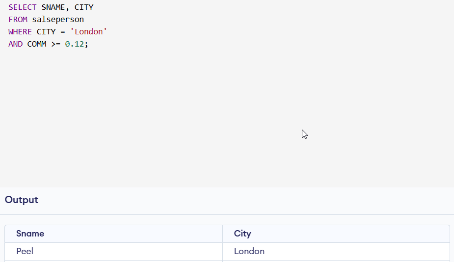
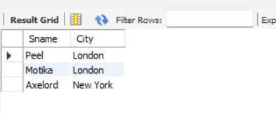

## Create table given below: Salesperson and Customer

## Salesperson :

```
CREATE DATABASE salseman;
```

```
CREATE TABLE `salseman`.`salseperson` (
  `Sno` INT NOT NULL,
  `Sname` VARCHAR(45) NOT NULL,
  `City` VARCHAR(45) NOT NULL,
  `Comm` FLOAT NOT NULL);

INSERT INTO `salseman`.`salseperson` (`Sno`, `Sname`, `City`, `Comm`)
VALUES (1001, 'Peel', 'London', 0.12),
(1002,'Serres','San Jose',0.13),
(1004,'Motika','London',0.11),
(1007,'Rafkin','Barcelona',0.15),
(1003,'Axelord','New York',0.1);

```

## Output Image


<hr>

## customer:

```
CREATE TABLE `salseman`.`customer` (
  `(PK)Cnm` INT NOT NULL,
  `Cname` VARCHAR(45) NOT NULL,
  `City` VARCHAR(45) NOT NULL,
  `Rating` INT NOT NULL,
  `(FK)Sno` INT NOT NULL);

INSERT INTO `salseman`.`customer` (`(PK)Cnm`, `Cname`, `City`, `Rating`,`(FK)Sno`)
VALUES (201, 'Hoffman', 'London', 100, 1001),
(202, 'Giovanne', 'Roe', 200, 1003),
(203, 'Liu', 'San Jose', 300, 1002),
(204, 'Grass', 'Barcelona', 100, 1002),
(206, 'Clemens', 'London', 300, 1007),
(207, 'Pereira', 'Roe', 100, 1004);

```

## Output Image


<hr>

## 12. Retrieve the below data from above table

```
SELECT *
FROM `salseman`.`customer`;
```

<hr>

## 13. All orders for more than $100

```
SELECT * FROM salseman.customer WHERE Rating > 100;
```

## Output Image


<hr>

## 14. Names and cities of all salespeople in London with commission above 0.12

```
SELECT SNAME, CITY
FROM salseman.salseperson
WHERE CITY = 'London'
AND COMM >= 0.12;
```

## Output Image



###### No Output

<hr>

## 15. All salespeople either in Barcelona or in London

```
SELECT
salseperson.Sname,
salseperson.City
FROM
salseman.salseperson
WHERE
salseperson.City IN ('Barcelona', 'London');
```

## Output Image


<hr>

## 16. All salespeople with commission between 0.10 and 0.12.

```
SELECT
salseperson.Sname,
salseperson.City
FROM
salseman.salseperson
WHERE
salseperson.Comm > 0.10
AND
salseperson.Comm < 0.12;
```

## Output Image



<hr>

## 17. All customers excluding those with rating <= 100 unless they are located in Roe

```
select
customer.Cname,
customer.City,
customer.Rating
from
salseman.customer
where
customer.Rating <= 100
or
customer.City = 'Roe';
```

## Output Image


<hr>
