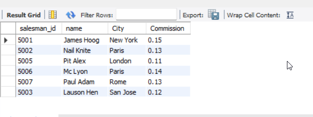

## Write a SQL statement that displays all the information about all salespeople

```
CREATE DATABASE salseman;
```

```
CREATE TABLE `salseman`.`salespeople` (
  `salesman_id` INT NOT NULL,
  `name` VARCHAR(45) NOT NULL,
  `City` VARCHAR(45) NOT NULL,
  `Commission` float NOT NULL);

INSERT INTO `salseman`.`salespeople` (`salesman_id`, `name`, `City`, `Commission`)
VALUES (5001, 'James Hoog', 'New York', 0.15),
(5002, 'Nail Knite', 'Paris', 0.13),
(5005, 'Pit Alex', 'London', 0.11),
(5006, 'Mc Lyon', 'Paris', 0.14),
(5007, 'Paul Adam', 'Rome', 0.13),
(5003, 'Lauson Hen', 'San Jose', 0.12);

```

<hr>

## Output Image


