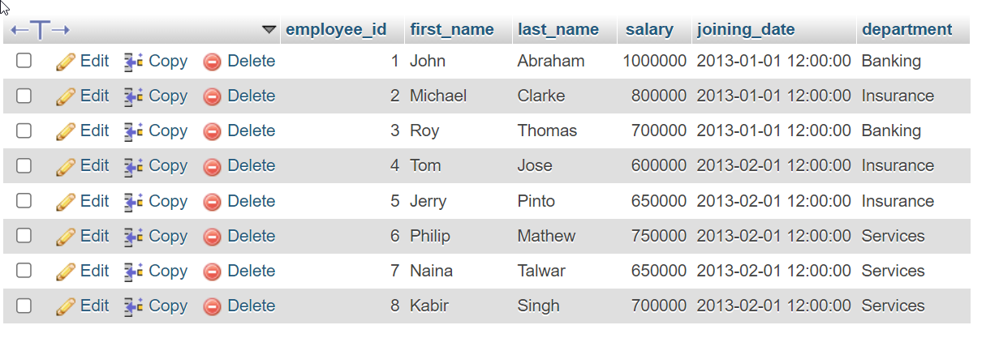
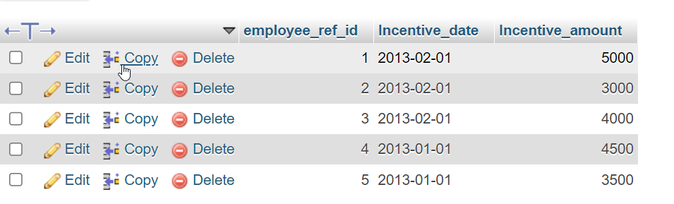

## Create table given below: Employee and IncentiveTable

<hr>

## Output Image



**Employee Table**

```
INSERT INTO employee(employee_id, first_name, last_name, salary, joining_date, department)
VALUES(1, 'John', 'Abraham', 1000000, '2023-01-01 12 00 00', 'Banking'),
(4, 'Tom', 'Jose', 600000, '2013-02-01 12:00:00', 'Insurance'),
(5, 'Jerry', 'Pinto', 650000, '2013-02-01 12:00:00', 'Insurance'),
(6, 'Philip', 'Mathew', 750000, '2013-02-01 12:00:00', 'Services'),
(7, 'Naina' , 'Talwar', 650000, '2013-02-01 12:00:00', 'Services'),
(8, 'Kabir', 'Singh', 700000, '2013-02-01 12:00:00', 'Services');
```

**Incentive Table**

```
INSERT INTO incentive(employee_ref_id, Incentive_date, Incentive_amount) VALUES
(1, '2013-02-01', 5000),
(2, '2013-02-01', 3000),
(3, '2013-02-01', 4000),
(4, '2013-01-01', 4500),
(5, '2013-01-01', 3500);
```

## Output Image


