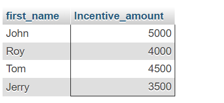

## Create table given below: Employee and IncentiveTable

<hr>

**Employee Table**

```
INSERT INTO employee(employee_id, first_name, last_name, salary, joining_date, department)
VALUES(1, 'John', 'Abraham', 1000000, '2023-01-01 12 00 00', 'Banking'),
(4, 'Tom', 'Jose', 600000, '2013-02-01 12:00:00', 'Insurance'),
(5, 'Jerry', 'Pinto', 650000, '2013-02-01 12:00:00', 'Insurance'),
(6, 'Philip', 'Mathew', 750000, '2013-02-01 12:00:00', 'Services'),
(7, 'Naina' , 'Talwar', 650000, '2013-02-01 12:00:00', 'Services'),
(8, 'Kabir', 'Singh', 700000, '2013-02-01 12:00:00', 'Services');
```

## Output Image


**Incentive Table**

```
INSERT INTO incentive(employee_ref_id, Incentive_date, Incentive_amount) VALUES
(1, '2013-02-01', 5000),
(2, '2013-02-01', 3000),
(3, '2013-02-01', 4000),
(4, '2013-01-01', 4500),
(5, '2013-01-01', 3500);
```

## Output Image


<hr>
<hr>

## 3. Get First_Name from employee table using Tom name “Employee Name”.


## 4. Get FIRST_NAME, Joining Date, and Salary from employee table.

```
SELECT first_name, joining_date, salary FROM employee;
```

## Output


## 5. Get all employee details from the employee table order by First_Name Ascending and Salary descending?

```
SELECT* FROM employee
ORDER BY first_name ASC, salary DESC;
```

## Output


## 6. Get employee details from employee table whose first name contains ‘J’.

```
SELECT* FROM employee
WHERE first_name LIKE '%J%';
```

## Output


## 7. Get department wise maximum salary from employee table order by salary ascending?

```
SELECT department, MAX(salary) AS maxsalary
FROM employee
GROUP BY department
ORDER BY maxsalary ASC;
```

## Output


## 9. Select first_name, incentive amount from employee and incentives table for those employees who have incentives and incentive amount greater than 3000

```
SELECT e.first_name, i.Incentive_amount
FROM employee e
JOIN incentive i ON e.employee_id = i.employee_ref_id
WHERE i.Incentive_amount > 3000;
```

## Output


