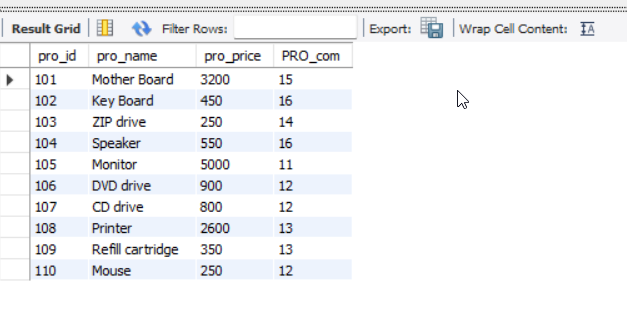
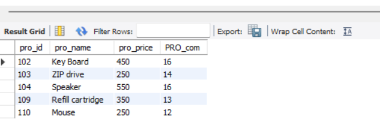
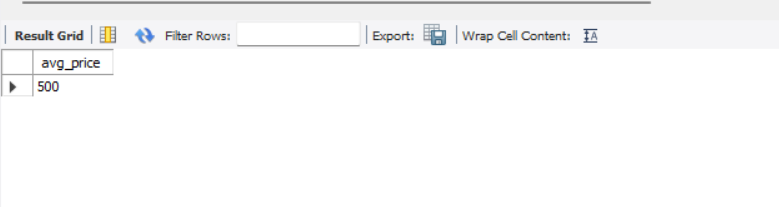
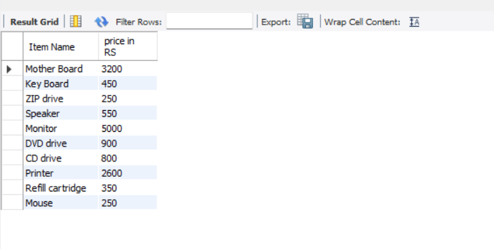
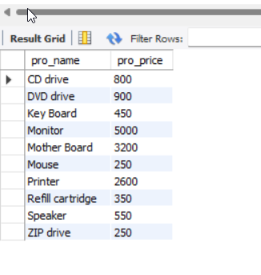
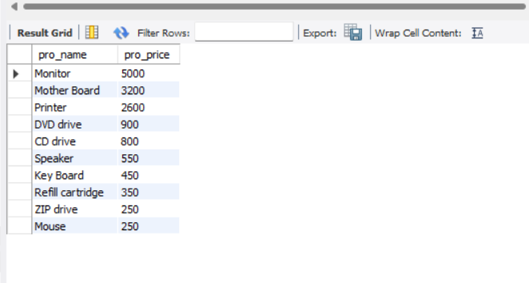
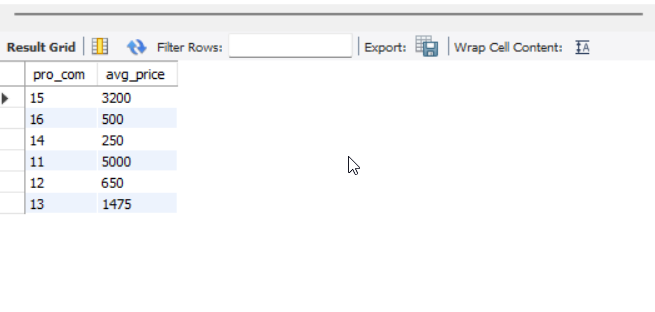

## Table: item_mast

```
CREATE DATABASE salseman;
```

```

CREATE TABLE `salseman`.`item_mast`(
`pro_id` INT NOT NULL,
`pro_name` VARCHAR(45) NOT NULL,
`pro_price` float NOT NULL,
`PRO_com` int NOT NULL);

INSERT INTO `salseman`.`item_mast` (`pro_id`, `pro_name`, `pro_price`, `PRO_com`)
VALUES
(101, 'Mother Board', 3200.00, 15),
(102, 'Key Board', 450.00, 16),
(103, 'ZIP drive', 250.00, 14),
(104, 'Speaker', 550.00, 16),
(105, 'Monitor', 5000.00, 11),
(106, 'DVD drive', 900.00, 12),
(107, 'CD drive', 800.00, 12),
(108, 'Printer', 2600.00, 13),
(109, 'Refill cartridge', 350.00, 13),
(110, 'Mouse', 250.00, 12);

```

<hr>

## Output Image



<hr>

## 20. From the following table, write a SQL query to select a range of products whose price is in the range Rs.200 to Rs.600. Begin and end values are included. Return pro_id, pro_name, pro_price, and pro_com.

```

SELECT pro_id, pro_name, pro_price, PRO_com
from salseman.item_mast
where pro_price between 200 and 600;

```

<hr>

## Output Image



<hr>

## 21. From the following table, write a SQL query to calculate the average price for a manufacturer code of 16. Return avg.

```

select avg(pro_price) as avg_price
from salseman.item_mast
where PRO_com = 16;

```

<hr>

## Output Image



<hr>

## 22. From the following table, write a SQL query to display the pro_name as 'Item Name' and pro_priceas 'Price in Rs.'

```

select pro_name as 'Item Name', pro_price as 'price in RS'
from salseman.item_mast;

```

<hr>

## Output Image



<hr>

## 23. From the following table, write a SQL query to find the items whose prices are higher than or equal to $250. Order the result by product price in descending, then product name in ascending. Return pro_name and pro_price.

```

select pro_name, pro_price
from salseman.item_mast
where pro_price >= 250
order by pro_price desc , pro_name asc;

```

<hr>

## product name in ascending



<hr>

## product price in descending



<hr>

## 24. From the following table, write a SQL query to calculate average price of the items for each company. Return average price and company code.

```

select pro_com, avg(pro_price) as avg_price
from salseman.item_mast
group by PRO_com;

```

<hr>

## Output Image



```

```
